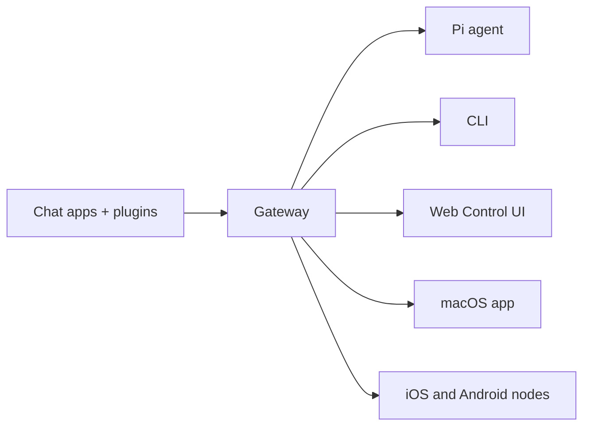

# 오픈클로 🦞

<p align="center">
    
    
</p>

> _"탈출! 각질 제거!"_ — 아마도 우주 랍스터일 겁니다.

<p align="center">
  <strong>WhatsApp, Telegram, Discord, iMessage 등의 AI 에이전트를 위한 모든 OS 게이트웨이.</strong><br/>
  메시지를 보내고 주머니에서 상담원의 응답을 받으세요. 플러그인은 Mattermost 등을 추가합니다.
</p>


  - [**Get Started**](/start/getting-started) - OpenClaw를 설치하고 몇 분 안에 게이트웨이를 가동하세요.

  - [**Run the Wizard**](/start/wizard) - `openclaw onboard` 및 페어링 흐름을 사용한 설정 안내.

  - [**Open the Control UI**](/web/control-ui) - 채팅, 구성 및 세션을 위한 브라우저 대시보드를 실행합니다.


## 오픈클로란 무엇인가요?

OpenClaw는 WhatsApp, Telegram, Discord, iMessage 등 즐겨 사용하는 채팅 앱을 Pi와 같은 AI 코딩 에이전트에 연결하는 **자체 호스팅 게이트웨이**입니다. 자신의 컴퓨터(또는 서버)에서 단일 게이트웨이 프로세스를 실행하면 메시징 앱과 항상 사용 가능한 AI 도우미 사이의 다리가 됩니다.

**누구를 위한 것인가요?** 데이터 제어권을 포기하거나 호스팅 서비스에 의존하지 않고도 어디에서나 메시지를 보낼 수 있는 개인 AI 비서를 원하는 개발자와 고급 사용자.

**무엇이 다른가요?**

- **자체 호스팅**: 귀하의 하드웨어, 귀하의 규칙에서 실행됩니다.
- **다중 채널**: 하나의 게이트웨이가 WhatsApp, Telegram, Discord 등을 동시에 서비스합니다.
- **에이전트 기반**: 도구 사용, 세션, 메모리 및 다중 에이전트 라우팅을 갖춘 코딩 에이전트용으로 구축됨
- **오픈 소스**: MIT 라이선스, 커뮤니티 기반

**무엇이 필요합니까?** Node 22+, API 키(Anthropic 권장), 5분.

## 작동 방식



게이트웨이는 세션, 라우팅 및 채널 연결에 대한 단일 정보 소스입니다.

## 주요 기능


  - **Multi-channel gateway** - 단일 게이트웨이 프로세스를 사용하는 WhatsApp, Telegram, Discord 및 iMessage.

  - **Plugin channels** - 확장 패키지로 Mattermost 등을 추가하세요.

  - **Multi-agent routing** - 에이전트, 작업 영역 또는 발신자별로 격리된 세션입니다.

  - **Media support** - 이미지, 오디오, 문서를 보내고 받습니다.

  - **Web Control UI** - 채팅, 구성, 세션 및 노드를 위한 브라우저 대시보드입니다.

  - **Mobile nodes** - iOS 및 Android 노드를 Canvas 지원과 페어링합니다.


## 빠른 시작


**Step 1: Install OpenClaw**


```bash
npm install -g openclaw@latest

```


**Step 2: Onboard and install the service**


```bash
openclaw onboard --install-daemon

```


**Step 3: Pair WhatsApp and start the Gateway**


```bash
openclaw channels login
openclaw gateway --port 18789

```


전체 설치 및 개발 설정이 필요합니까? [빠른 시작](/start/quickstart)을 참조하세요.

## 대시보드

게이트웨이가 시작된 후 브라우저 제어 UI를 엽니다.

- 로컬 기본값: [http://127.0.0.1:18789/](http://127.0.0.1:18789/)
- 원격 접속: [웹 표면](/web/) 및 [Tailscale](/gateway/tailscale)

<p align="center">
  
</p>

## 구성(선택 사항)

구성은 `~/.openclaw/openclaw.json`에 있습니다.

- **아무것도 하지 않으면** OpenClaw는 발신자별 세션과 함께 RPC 모드에서 번들로 제공되는 Pi 바이너리를 사용합니다.
- 잠그고 싶다면 `channels.whatsapp.allowFrom`로 시작하고 (그룹의 경우) 규칙을 언급하세요.

예:

```json5
{
  channels: {
    whatsapp: {
      allowFrom: ["+15555550123"],
      groups: { "*": { requireMention: true } },
    },
  },
  messages: { groupChat: { mentionPatterns: ["@openclaw"] } },
}
```

## 여기서 시작하세요


  - [**Docs hubs**](/start/hubs) - 모든 문서와 가이드는 사용 사례별로 정리되어 있습니다.

  - [**Configuration**](/gateway/configuration) - 핵심 게이트웨이 설정, 토큰 및 공급자 구성.

  - [**Remote access**](/gateway/remote) - SSH 및 tailnet 액세스 패턴.

  - [**Channels**](/channels/telegram) - WhatsApp, Telegram, Discord 등에 대한 채널별 설정입니다.

  - [**Nodes**](/nodes/) - 페어링 및 Canvas가 포함된 iOS 및 Android 노드.

  - [**Help**](/help/) - 일반적인 수정 사항 및 문제 해결 진입점.


## 자세히 알아보기


  - [**Full feature list**](/concepts/features) - 완전한 채널, 라우팅 및 미디어 기능.

  - [**Multi-agent routing**](/concepts/multi-agent) - 작업 공간 격리 및 에이전트별 세션.

  - [**Security**](/gateway/security/) - 토큰, 허용 목록 및 안전 제어.

  - [**Troubleshooting**](/gateway/troubleshooting) - 게이트웨이 진단 및 일반적인 오류.

  - [**About and credits**](/reference/credits) - 프로젝트 출처, 기여자 및 라이선스.

